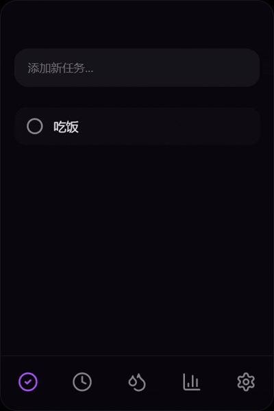
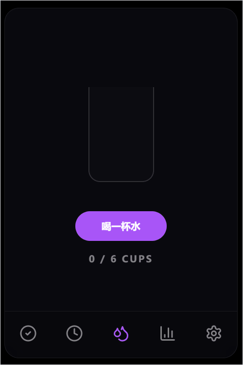
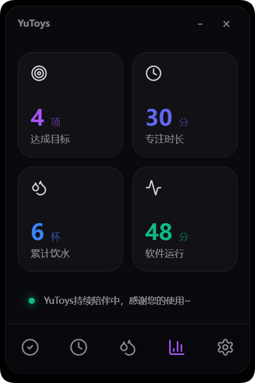
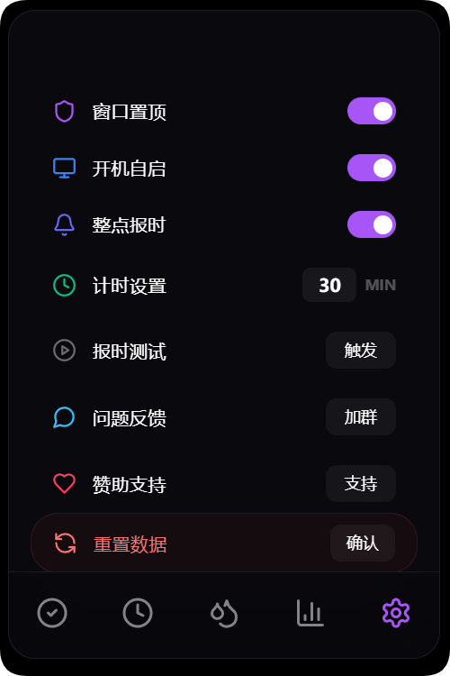

# 🏆 YuToys - 极致视觉桌面助手

**YuToys** 诞生于对“工具美学”的执着追求。它不仅是一个多功能助手，更是一件融合了玻璃拟态艺术与沉浸式交互的桌面数字艺术品。

---

## 📽️ 沉浸式功能巡礼 (Feature Highlights)

### 📝 灵动任务管理

| 演示                                              | 核心特性                                                               |
| :------------------------------------------------ | :--------------------------------------------------------------------- |
|  | **无感修改**：双击目标任务内容即可原位编辑，逻辑顺畅无打断。           |
|  | **成就礼赞**：完成单项任务触发烟花，清空清单更有**全屏强力烟花**庆贺。 |

### ⏳ 深度专注空间

| 演示                                          | 核心特性                                                                                                                    |
| :-------------------------------------------- | :-------------------------------------------------------------------------------------------------------------------------- |
|  | **见证时间消融**：支持 1-99 分钟自定义，紫色圆环随倒计时优雅消失。单击圆盘即可暂停/恢复。计时结束享有**持久震撼烟花**奖励。 |

### 💧 每日科学饮水

| 演示                                            | 核心特性                                                                                                      |
| :---------------------------------------------- | :------------------------------------------------------------------------------------------------------------ |
|  | **科学补水追踪**：预设 6 杯水健康目标。每达成一个单位，波纹灵动起舞。全天达成时刻，绽放专属**蓝色主题烟花**。 |

### 📊 专注成果审计

| 截图                                          | 核心特性                                                                                           |
| :-------------------------------------------- | :------------------------------------------------------------------------------------------------- |
|  | **全量看板统计**：囊括任务、专注与饮水全量数据。让每一分努力都有迹可循，让专注的成果真正“看得见”。 |

### ⚙️ 极致掌控中心

| 截图                                             | 核心特性                                                                                                                                                                                                                                 |
| :----------------------------------------------- | :--------------------------------------------------------------------------------------------------------------------------------------------------------------------------------------------------------------------------------------- |
|  | **精细化定制**：<ul><li>**窗口置顶**：专注时刻始终处于视野焦点。</li><li>**整点报时**：结合原生通知，每个整点准时提醒。</li><li>**开机自启**：YuToys 随系统启动，长久陪伴。</li><li>**安全重置**：双重确认机制，守护数据安全。</li></ul> |

---

## 🛡️ 专业级打磨 (Technical Polish)

- ⚡ **秒级冷启动**：采用 `store` 级零损解压技术，实现极致“秒开”。
- 🔔 **品牌化通知**：结合 Windows 原生通知，实现整点报时与品牌标识统一。
- 🔊 **100% 离线运行**：所有铃声音效与动效资源均已内置。
- 💾 **环境自适应**：自动同步开发环境与打包版数据，数据永不丢失。

---

## 🛠️ 技术栈 (Tech Stack)

- **前端框架**: React 19 + TypeScript
- **状态管理**: Zustand
- **动效引擎**: Framer Motion + Canvas Confetti
- **底层架构**: Electron 40 + Vite

---

> [!IMPORTANT]
> **设计师寄语**：好的工具应如同呼吸般自然。我们调教了每一帧的物理摩擦与阻尼，只为在您的桌面上营建一处宁静的专注之所。

**YuToys 愿每一份专注，都被温柔以待。**
