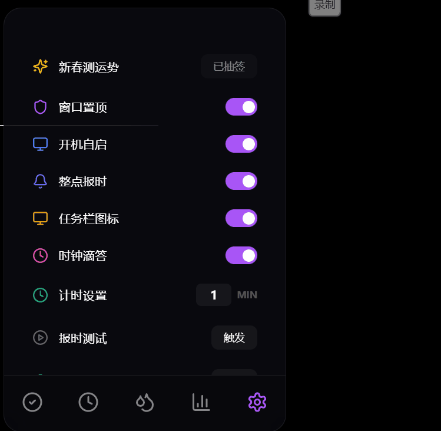

# 💜 YuToys - 小羽桌面助理


**YuToys** 不仅仅是一款桌面工具，它是您的私人数字化陪伴者 —— **小羽**。
诞生于对“工具温情化”与“极致视觉”的执着追求，小羽将陪伴您划过每一个专注的时刻，见证每一项任务的达成。

---

## 📽️ 视觉巡礼 (Visual Tour)

```carousel

<!-- slide -->

<!-- slide -->

<!-- slide -->

<!-- slide -->

```

---

## ✨ 核心特色巡礼 (Feature Highlights)

### 🎬 仪式感入场：小羽启动动画

每一次开启，都是一次庄重的会面。小羽专属的 **SplashScreen** 采用电影级呼吸灯效，在紫色星尘中为您拉开高效一天的序幕。


### ⏳ 沉浸式专注空间 (Deep Focus)

- **成就庆典**：每当您完成一次专注，全屏烟花礼赞将为您绽放。
- **动态呼吸**：可视化倒计时圆环，陪伴您劳逸结合。
  

### 📝 灵动任务管理 (Staggered Tasks)

- **无感交互**：阶梯式淡入动效，双击即修，失焦即存。
- **及时反馈**：小礼花点缀任务达成的瞬间。
  

### 📊 呵护提醒与全量统计 (Assistant & Stats)

- **小羽呵护**：
  - **整点报时**：温馨提醒时光流逝。 
  - **饮水养成**：关爱主人的身体。 
- **极致统计**：四维看板实时记录成长点滴。
  

### 🧧 新春特供：喵系测运势

集成在设置面板中的“新春签筒”，每天可向小羽抽取一次今日运势。结果均为上上签/大吉等吉祥语，为主人带去整天的好运喵！


---

## 🏗️ 技术底座 (Technical Architecture)

YuToys 采用了前沿的桌面开发技术栈，确保丝滑体验与极低开销并存：

- **核心架构**: [Electron](https://www.electronjs.org/) + [Vite](https://vitejs.dev/)
- **界面逻辑**: [React 19](https://react.dev/) + [TypeScript](https://www.typescriptlang.org/)
- **动效灵魂**: [Framer Motion](https://www.framer.com/motion/) + [Canvas Confetti](https://www.npmjs.com/package/canvas-confetti)
- **状态管理**: [Zustand](https://zustand-demo.pmnd.rs/) (支持数据本地持久化)

---

## 🛠️ 开发者起步 (Quick Start)

如果您希望在本地进行二次开发或构建：

```bash
# 安装依赖
npm install

# 启动开发服务器
npm run dev

# 打包为可执行文件 (EXE)
npm run build
```

---

## 📖 审美与复盘

YuToys 的每一处阻尼、每一格阴影都经过精心调教。如果您对我们的视觉参数或开发细节感兴趣，请移步：

- **[KNOWLEDGE_BASE.md](./KNOWLEDGE_BASE.md)**：记录了本项目的黄金提示词、审美资产与踩坑指南。

---

> [!TIP]
> **小羽寄语**：好的工具应如同空气般自然，又如同挚友般温暖。愿 YuToys 的陪伴能让您的专注不再孤独。
>
> **YuToys - 愿每一份专注，都被温柔以待。💜喵～**
