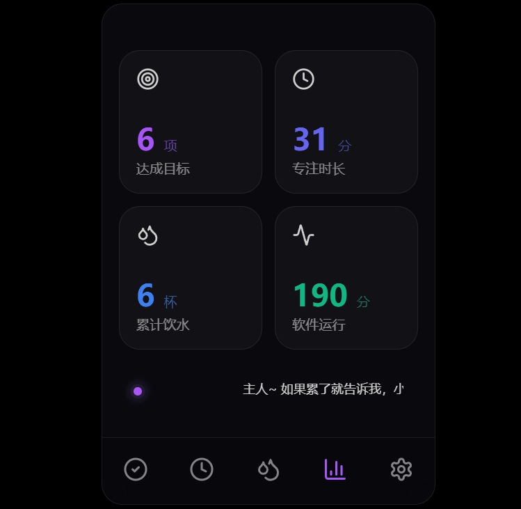
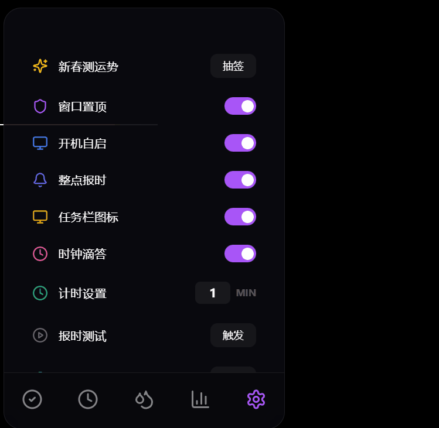
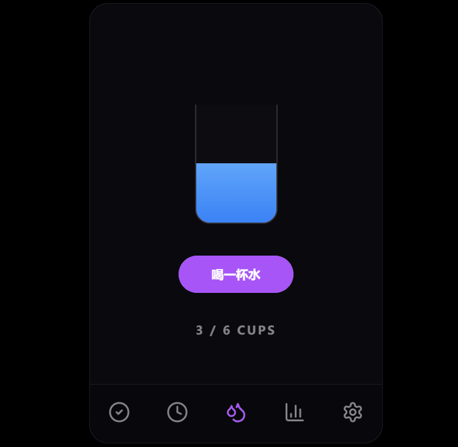
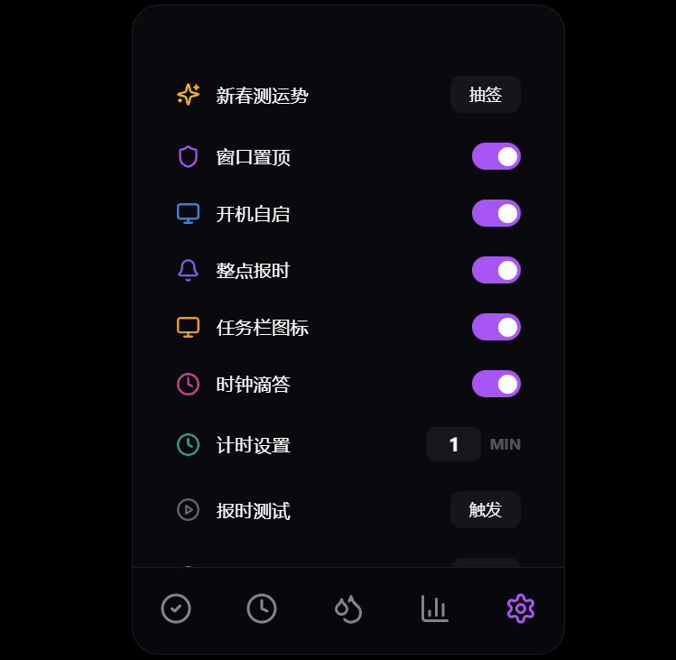

# 💜 YuToys - 小羽桌面助理


**YuToys** 是一款将“极致工程审美”与“二次元陪伴”深度融合的桌面办公/学习效率工具。它不仅仅是一个倒计时或任务栏，更是您的私人数字化陪伴者 —— **小羽**。

### 🌟 助理定位与特色

- **猫娘性格深度适配**：内置 **100+ 条精心调教的性格化语料库**。无论您是开启挑战、感到疲惫、还是顺利达成目标，小羽都会以独特的傲娇或温情姿态给予反馈。
- **极致视觉美学**：全界面采用 **现代玻璃拟态 (Glassmorphism)** 设计，丝滑的层级投影与 0.5s 阶梯式动效，让每一次点击都充满阻尼感与高级感。
- **仪式感驱动**：从启动到结项，全流程动效覆盖，将枯燥的办公流程转化为充满仪式感的交互体验。

---

## 📽️ 功能演示与特色巡礼 (Feature Highlights)

### 1️⃣ 🎬 仪式感入场：启动动画

每一次开启，都是一次庄重的会面。小羽专属的 **SplashScreen** 采用电影级呼吸灯效，在紫色星尘中为您拉开高效一天的序幕。


---

### 2️⃣ 📝 灵动任务管理 (Task Management)

小羽的任务管理旨在消除操作的突兀感，不仅是记录，更是一种“流体”体验。

- **无感编辑**：极致简约的交互逻辑，双击即修，失焦即存。
- **反馈美学**：任务达成的瞬间，除了小礼花点缀，还会触发小羽的专属欢呼。
  
  

---

### 3️⃣ ⏳ 沉浸式专注空间 (Deep Focus)

将番茄钟精细化为视觉与听觉的双重盛宴。

- **动态呼吸光环**：可视化倒计时设计，支持 **1-99 分钟** 深度自定义修改。
- **沉浸听感**：内置 **时钟滴答 (Ticking)** 模拟音效（支持开关），助您快速进入 Flow 状态。
- **成就庆典**：专注结束时，全屏彩色烟花礼赞将为您绽放。
  

---

### 4️⃣ 📊 核心统计与语境对话 (Stats & Assistant)

小羽会实时记录您的每一分努力，并给予最直观的反馈。

- **四维数据看板**：实时汇总“达成目标”、“专注时长”、“累计饮水”与“运行时间”。
- **语境对话墙**：底部的跑马灯会根据当前的统计数据与时间，触发不同的随机台词。100+ 条语料确保了小羽的丰富生命力。
  

---

### 5️⃣ ⚙️ 系统设置与呵护算法 (Settings & Care)

在设置版块，您可以深度定制小羽的各项能力。

- **新春测运势 (Limited)**：集成每日签筒，抽取属于您的今日开运语（均为大吉/上上签喵！）。
- **智能饮水提醒**：内置 **基于运行时间的自动计算算法**，每隔 60 分钟自动弹出温情通知，关爱主人的身体。
- **系统级集成**：
  - **整点报时**：温馨提醒时光流逝。
  - **开机自启**：2.0.1 已深度适配 Portable 路径识别，一键入场。
  - **置顶/通知**：支持窗口置顶与静默通知，不干扰主人的专注。

|              新春测运势              |               整点报时测试                |
| :----------------------------------: | :---------------------------------------: |
|  |  |

|                温情通知反馈                 |                 智能饮水提醒                  |
| :-----------------------------------------: | :-------------------------------------------: |
|  |  |



---

## 🏗️ 技术底座 (Technical Architecture)

YuToys 采用了前沿的桌面开发技术栈，确保丝滑体验与极低开销并存：

- **核心架构**: [Electron](https://www.electronjs.org/) + [Vite](https://vitejs.dev/)
- **界面逻辑**: [React 19](https://react.dev/) + [TypeScript](https://www.typescriptlang.org/)
- **动效灵魂**: [Framer Motion](https://www.framer.com/motion/) + [Canvas Confetti](https://www.npmjs.com/package/canvas-confetti)
- **状态管理**: [Zustand](https://zustand-demo.pmnd.rs/) (支持数据本地持久化)

---

## 🛠️ 快速起步

```bash
# 安装依赖
npm install

# 启动开发服务器
npm run dev

# 打包为正式版
npm run build
```

---

> [!TIP]
> **小羽寄语**：好的工具应如同空气般自然，又如同挚友般温暖。愿 YuToys 的陪伴能让您的专注不再孤独。
>
> **YuToys - 愿每一份专注，都被温柔以待。💜喵～**
